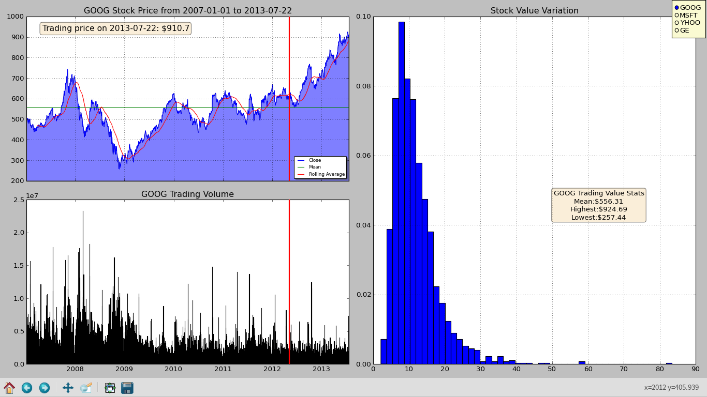
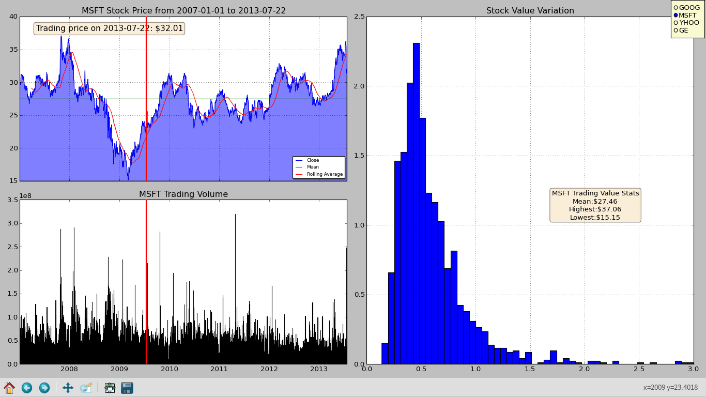

StockPy
=======

Stock Market Analysis using Python
Simple Python program to perform basic stock analysis.

Required Module: Numpy, Pandas, Matplotlib

Site: https://sites.google.com/site/narasimhaweb/projects/stockpy

Video : https://www.youtube.com/watch?v=UYhjfo3umpo

Author: Narasimha Prasad Prabhu

